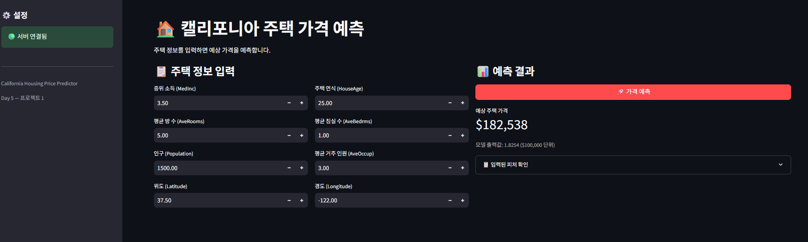
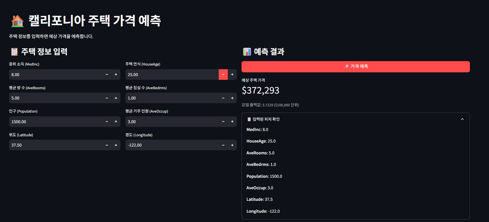
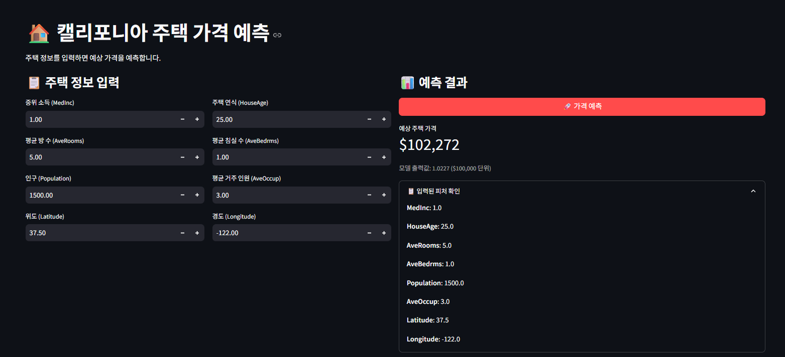
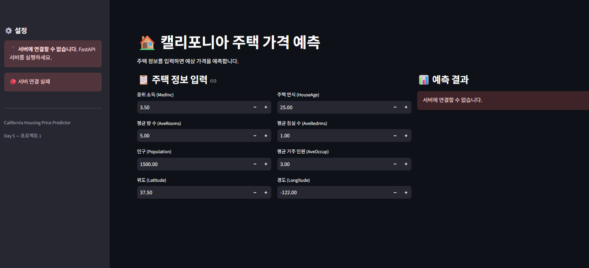
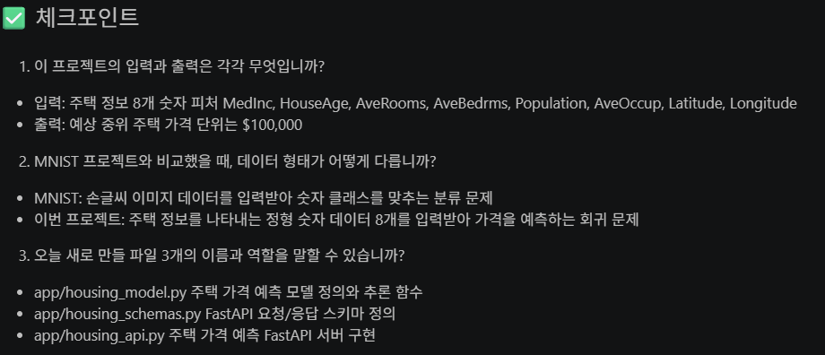
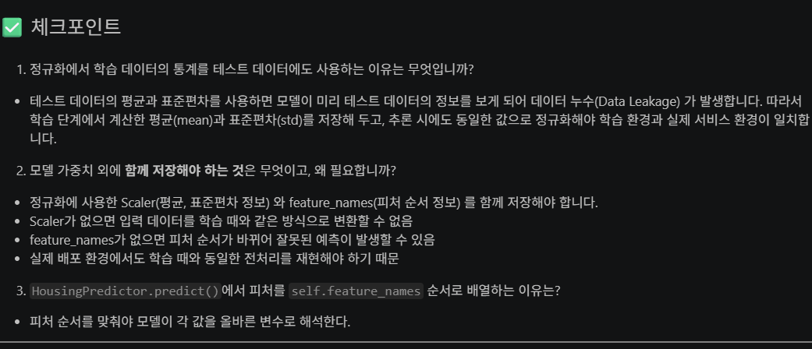
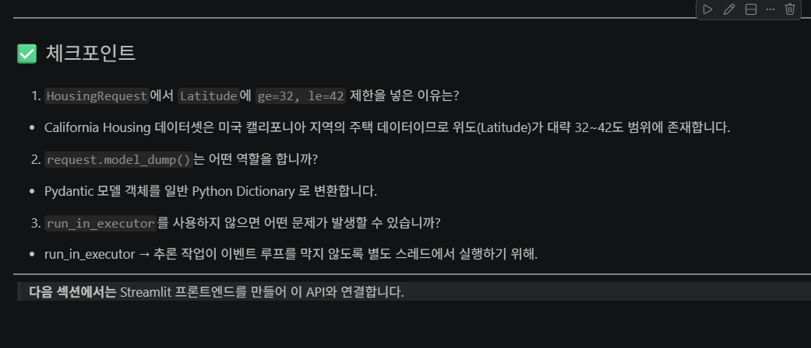
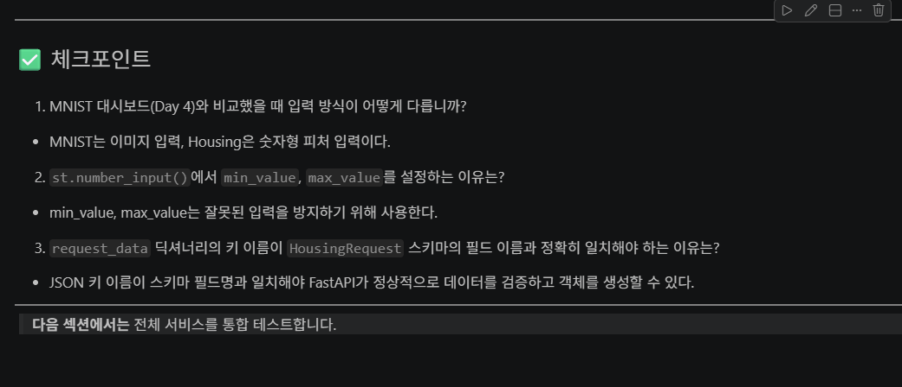
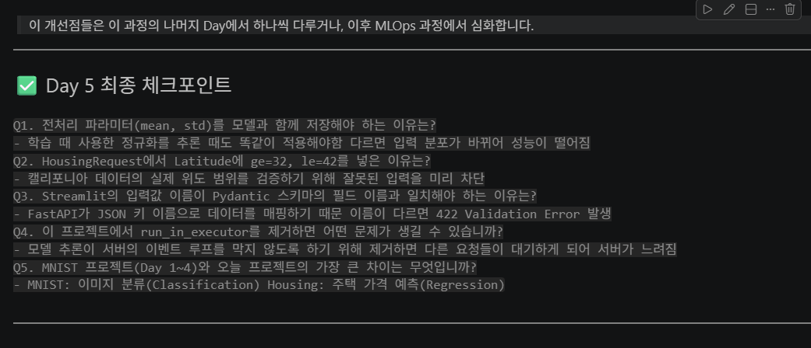

# 1. 백엔드서버 처음 실행했을때 서버가 잘연결되어있는지 확인

## 2. 테스트 2 중위소득 8.00으로 변경

## 3. 테스트 2-1 중위소득 1.00으로 변경

## 4. 에러상황 백엔드서버껏을때

## 5. 체크포인트 1

## 5. 체크포인트 2

## 5. 체크포인트 3

## 5. 체크포인트 4

## 5. 체크포인트 5

