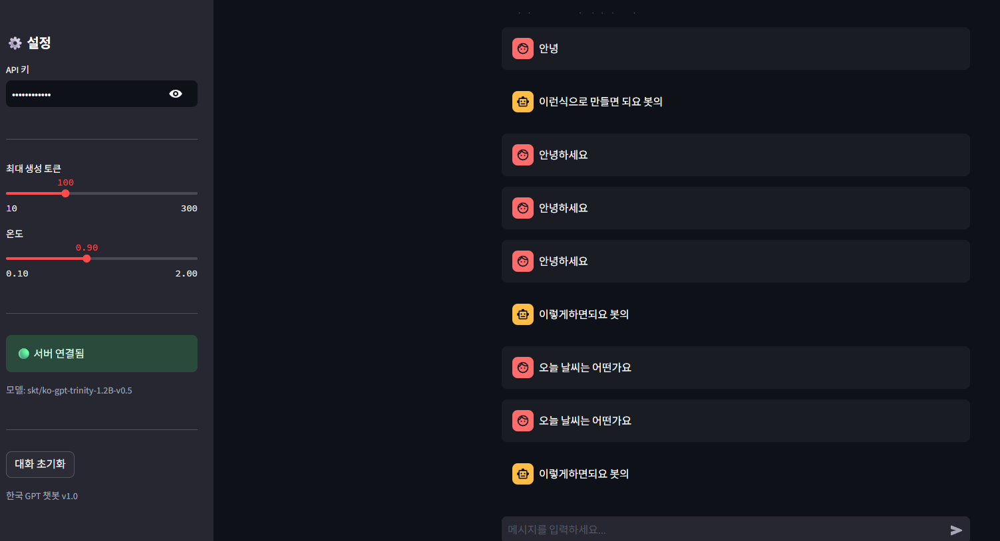
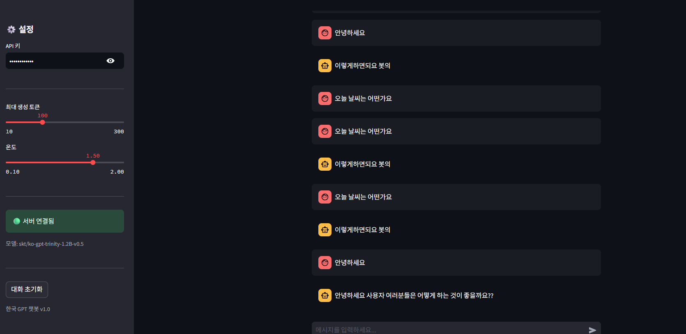
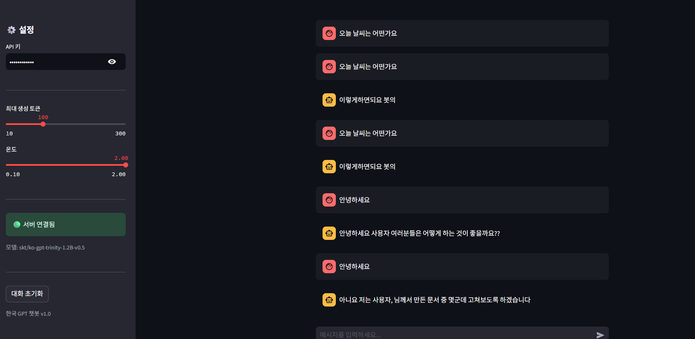
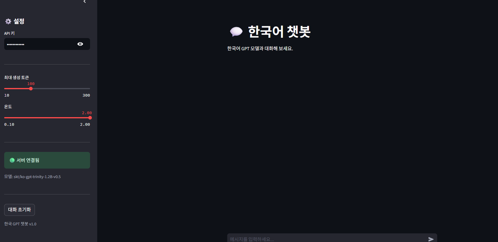
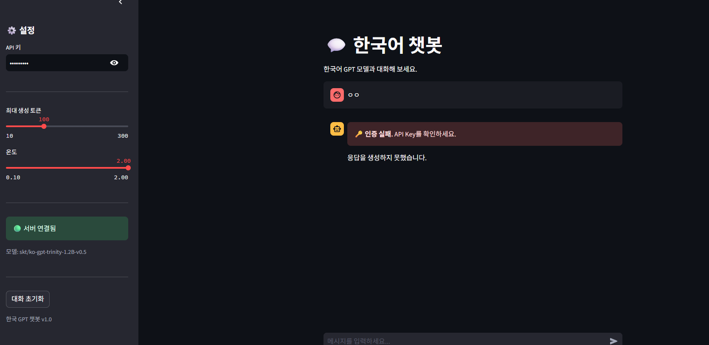
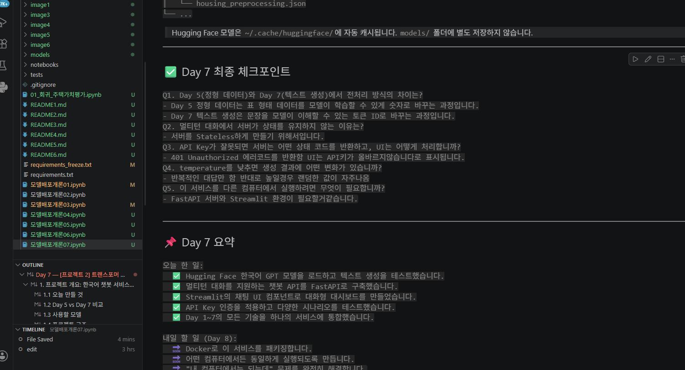
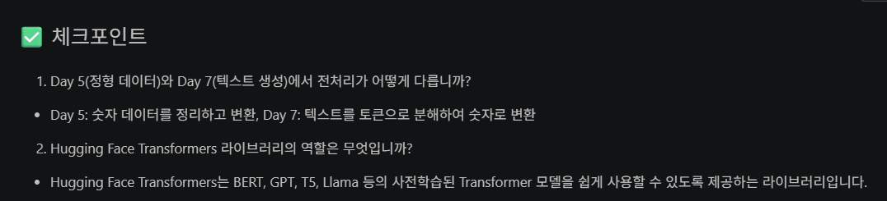
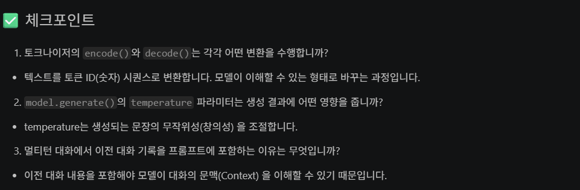
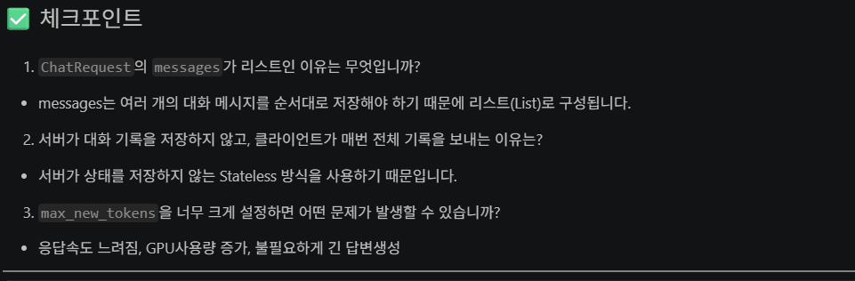
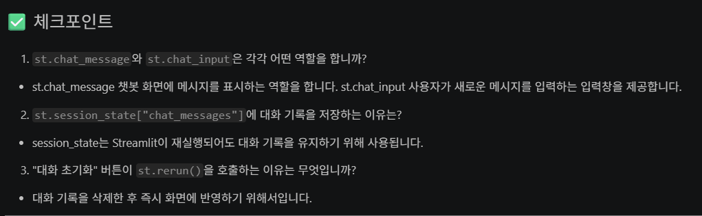

## 1. 테스트1~4 실행결과

### 처음 실행했을때

### 1.5로 세팅했을때

### 2.0으로 세팅했을때

### 대화 초기화 눌렀을때

### 잘못된 API키 입력했을때

## 2. day7 최종체크포인트

## 3. 체크포인트 1

## 4. 체크포인트 2

## 5. 체크포인트 3

## 6. 체크포인트 4

## 7. 회고

- 저번에 배운 것들이 다시 복습하는 기분이어서 머릿속에 키워드가 남아서 이해가 빨랐습니다.
- 저번에 만든 챗봇은 그냥 local 환경에서만 돌려봤던 그런 챗봇이었는데 프론트엔드랑 백엔드를 사용해 직접 구동해보니 감회가 새로웠습니다.

