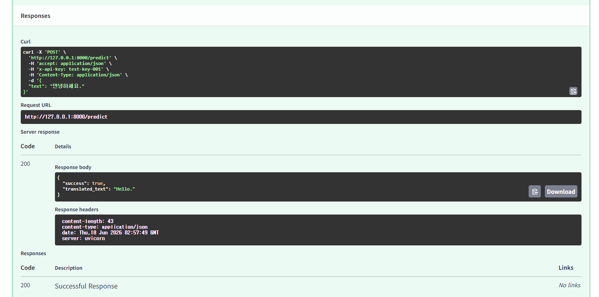
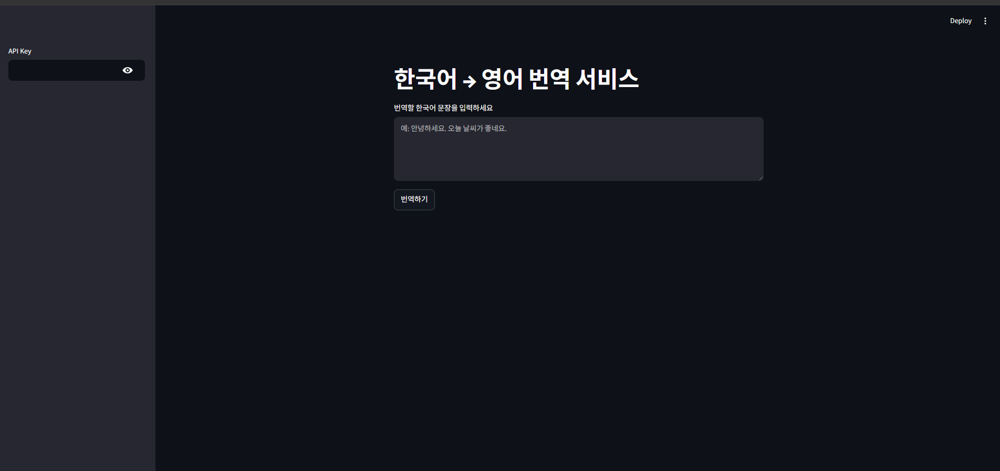
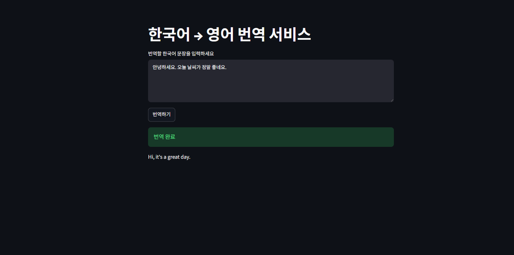
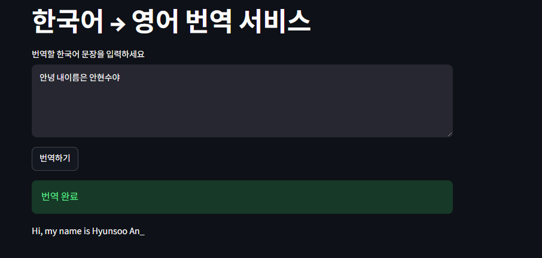
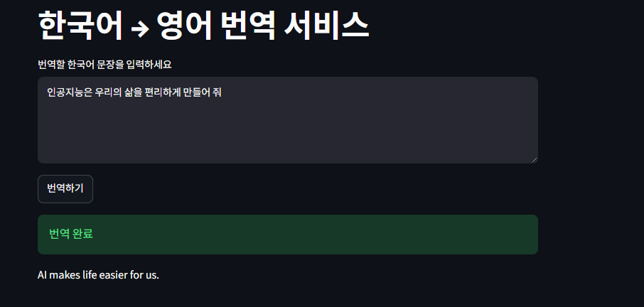

## 번역기 모델 

  1. 어떤 도메인/태스크를 선택했는가?
- 짧은 시간안에 만들어야 하는 과제인만큼 최소한의 시행착오와 간단한 학습만으로도 성능이 나오는 번역기 모델을 선택하였습니다.

  2. 모델 선정이유
  
- Hugging Face의 "Helsinki-NLP/opus-mt-ko-en" 모델을 사용했습니다.
- 선택 이유는 다음과 같습니다.
- 한국어 → 영어 번역에 특화된 사전학습 모델
- 추가 학습 없이 바로 사용 가능
- 모델 크기가 비교적 작아 CPU 환경에서도 실행 가능
- Hugging Face에서 제공하여 FastAPI와 쉽게 연동 가능

3. swagger 시연 및 streamlit

## swagger ui 테스트 성공
 

## 처음 실행화면

 

## 번역1

 

## 번역2 여기서 이부분은 고유명사라 제 이름은 잘 인식하지않았습니다.

 

## 3. 개선

 

- 고유명사 전처리를 해준뒤 개선이 되었습니다.

## 4. 다시테스트 다른문장

 

 회고는 ui 개선 및 디자인 개선 그리고 이제 다른언어들을 추가하여 모델적용시키고 학습시켜서 구글번역기와 비슷한 기능을 하게 만들면 좋겠습니다.
 그리고 파파고에 있는 사진번역기능까진 나중에 이미지 인식 학습을 통하여서 되지않을까 생각하고있습니다.

